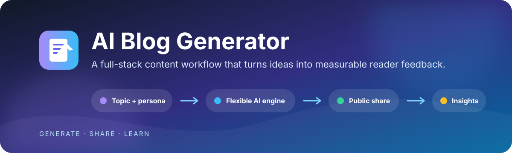
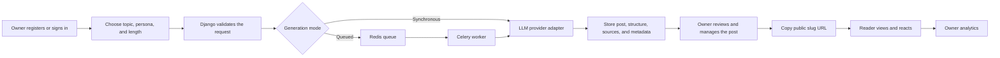
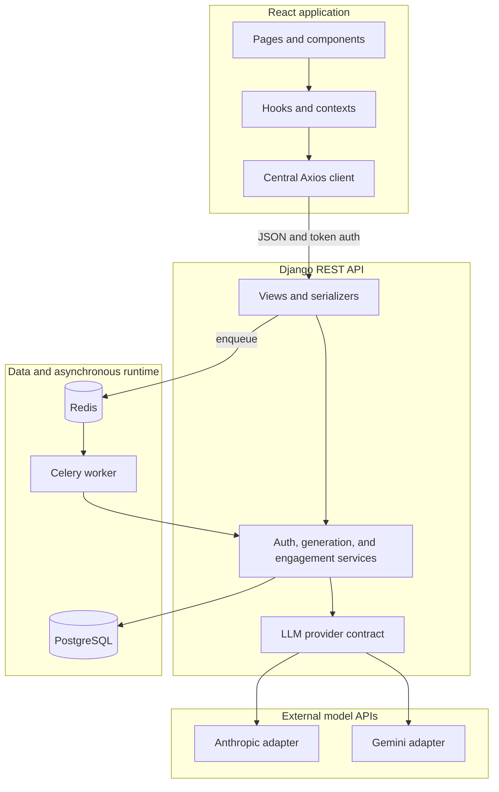

<div align="center">
  

  <br />

  <a href="https://github.com/ariftayyab123/Aiblogapp/actions/workflows/ci.yml"></a>
  
  
  
  
  

  <p><strong>Turn a topic into structured content, share it with readers, and use real feedback to understand what resonates.</strong></p>
  <p>AI Blog Generator is a full-stack content workflow for individuals and small content teams that need more than a one-shot text prompt.</p>

  <p>
    <a href="#why-this-product">Why it matters</a> ·
    <a href="#how-it-works">Workflow</a> ·
    <a href="#capabilities">Capabilities</a> ·
    <a href="#architecture">Architecture</a> ·
    <a href="#deployment-options">Deploy</a> ·
    <a href="#local-development">Develop</a> ·
    <a href="#current-boundaries">Boundaries</a>
  </p>
</div>

---

## Why this product

Generic text generation stops when the model returns an answer. AI Blog Generator adds the application workflow around that answer: identity, ownership, reusable writing personas, persistence, public distribution, reader feedback, and owner-scoped analytics.

It is designed for:

- content creators who want repeatable writing styles rather than rebuilding prompts;
- small marketing or editorial teams validating topics and formats;
- product and engineering teams demonstrating a production-shaped LLM integration;
- developers studying how React, Django, PostgreSQL, Redis, Celery, and external model APIs work together.

### Business value

| Challenge | Product response | Practical outcome |
|---|---|---|
| Blank-page friction | Topic-driven generation with four seeded writing personas | A guided starting point for technical, narrative, analytical, or educational content |
| Inconsistent output | Centralized prompt templates and persona-level generation settings | More repeatable structure and tone |
| Disconnected publishing feedback | Public share pages with `Helpful` / `Not helpful` reactions | A direct signal from readers without requiring reader accounts |
| No visibility across content | Owner-scoped totals, feedback counts, scores, sorting, and date filters | A focused view of which posts are receiving positive or negative responses |
| Model lock-in | A provider-neutral backend boundary with Anthropic and Gemini adapters | Operators can change the configured provider without changing the user experience |
| Long-running request risk | Synchronous and Celery-backed generation modes | A simple MVP path and a worker-based path for longer jobs |

> This application accelerates drafting; it does not replace editorial review. Generated facts, links, and citations must be verified before publication.

## How it works



1. An account owner enters a topic, chooses a writing persona, and selects brief or detailed generation.
2. Django builds the prompt and sends it through the configured LLM adapter.
3. The result is parsed into Markdown, source references, structural metadata, and a persisted post.
4. The owner can review the post, copy its public link, or delete it.
5. Public readers can submit one reaction per browser session and post.
6. The owner sees aggregated feedback and post rankings in the analytics dashboard.

## Capabilities

### Content workflow

- Four seeded personas: Technical Writer, Storyteller, Industry Analyst, and Educator.
- Brief and detailed generation modes with separate word and token budgets.
- Markdown rendering, extracted headings, word count, estimated reading time, and structured source metadata.
- Queue status polling with progress, timeout handling, cancellation of client polling, and retry support.
- Owner-scoped post lists, detail pages, filtering, and confirmed deletion.

### Distribution and feedback

- Public, navbar-free share pages addressed by post slug.
- Anonymous `Helpful` / `Not helpful` feedback.
- Database uniqueness preventing multiple simultaneous reactions for the same post and browser session.
- Owner-only analytics with feedback totals, helpfulness score, date filters, sorting, and refresh controls.

### Platform and operations

- Token-based registration and login with protected frontend routes.
- Server-enforced ownership for private post and analytics queries.
- Thin DRF views backed by service-layer business logic.
- Provider-neutral LLM integration with normalized responses and user-safe errors.
- Retry, timeout, and circuit-breaker controls around model calls.
- Redis-backed Celery jobs and shared production caching.
- Liveness and readiness endpoints for deployment verification.

## Records and traceability

The application retains enough context to explain the lifecycle of a generated post without claiming formal audit or compliance capabilities.

| Record | What it provides |
|---|---|
| `BlogPost` | Owner, topic, rendered prompt, generated Markdown, lifecycle status, timestamps, structure, sources, and generation metadata |
| `GenerationJob` | Queued/running/completed/failed status, progress, task identifier, owner, selected persona, and failure message |
| `Engagement` | Post, browser session identifier, reaction, timestamps, and a database uniqueness constraint |
| Analytics response | Owner-scoped totals and per-post helpfulness signals calculated from stored reactions |
| Health endpoints | Basic application liveness plus database/Redis readiness |

Source references are extracted from model output and currently start as unverified. There is no retrieval or fact-checking pipeline in this repository.

## Users and access boundaries

| User group | Access |
|---|---|
| Account owner | Generate content, list and view owned posts, delete owned posts, copy share links, and view owned analytics |
| Public reader | Read completed posts by slug and submit anonymous feedback |
| Operator / Django administrator | Configure infrastructure and providers, seed personas, inspect administrative records, and monitor services |

Private API querysets are filtered by authenticated owner. Public sharing is intentionally separate from the owner dashboard.

## Integrations

| Integration | Purpose | Configuration boundary |
|---|---|---|
| Anthropic | LLM generation adapter | Backend-only `ANTHROPIC_*` variables |
| Google Gemini | Alternative LLM generation adapter | Backend-only `GEMINI_*` variables |
| PostgreSQL | Persistent application, ownership, job, and engagement data | `DATABASE_URL` or local `DB_*` variables |
| Redis | Celery broker/result backend and shared cache | `REDIS_URL` and optional `CACHE_URL` |
| Celery | Background generation worker | Same database, Redis, and LLM configuration as the web service |
| Vercel | React hosting and optional synchronous Django deployment | Project environment variables |
| Render | Django web service, worker, PostgreSQL, and Redis blueprint | [`render.yaml`](render.yaml) |

Provider selection is operational configuration, not a user-facing product choice:

```env
# Select exactly one provider at runtime
LLM_PROVIDER=gemini
GEMINI_API_KEY=<GEMINI_API_KEY>
GEMINI_MODEL=gemini-2.0-flash
GEMINI_FAST_MODEL=gemini-2.0-flash
```

Use `LLM_PROVIDER=anthropic` with the corresponding `ANTHROPIC_*` variables to switch adapters. Never place provider keys in frontend variables or commit them to Git.

## Architecture



The generation service owns application concerns such as prompts, persistence, retries, and lifecycle transitions. Provider adapters own vendor-specific authentication, payloads, responses, and error normalization. This keeps the product generic while still supporting concrete APIs.

### Technology choices

| Layer | Technology | Responsibility |
|---|---|---|
| Web interface | React 18, Vite, Tailwind CSS, React Router | Responsive screens, protected navigation, generation progress, sharing, and analytics |
| API | Python, Django 4.2, Django REST Framework | Authentication, validation, authorization, orchestration, and JSON endpoints |
| Persistence | PostgreSQL, Django ORM | Ownership, content, generation jobs, source metadata, and engagement constraints |
| Background work | Celery and Redis | Asynchronous generation and job state |
| Model integration | Anthropic SDK and Gemini REST adapter | Interchangeable content-generation providers |
| Delivery | Docker Compose, Vercel configuration, Render Blueprint | Local and hosted runtime options |
| Quality gates | ESLint, Django checks/tests, GitHub Actions | Static checks, build validation, and backend configuration checks |

## Deployment options

| Option | Best fit | Runtime notes |
|---|---|---|
| Vercel frontend + Render backend | Recommended hosted topology | Uses the tracked Render blueprint for Django, Celery, PostgreSQL, and Redis |
| Two Vercel projects | Lightweight synchronous deployment | Frontend and Django deploy separately; use `QUEUE_ALWAYS_SYNC=True` because Vercel does not host a persistent Celery worker |
| Docker Compose | Local development and self-managed evaluation | Runs frontend, backend, PostgreSQL, Redis, and worker containers; production hardening remains the operator's responsibility |

Deployment guides:

- [Render backend, worker, database, and Redis](docs/DEPLOY_RENDER.md)
- [Vercel frontend and synchronous backend option](docs/DEPLOY_VERCEL.md)

### Safe deployment and update sequence

```text
reviewed source
  → database backup
  → environment and secret validation
  → dependency/build validation
  → application deployment
  → forward database migrations
  → persona/integration updates
  → liveness and readiness checks
  → registration/generation/share verification
  → rollback if required
```

PostgreSQL data lives outside application containers in a named Docker volume or managed database. Application deployment must not recreate or delete that storage. Take a provider-supported backup before migrations and keep the previous application artifact available for rollback; database rollback requires a migration-specific plan or backup restoration.

## Local development

### Prerequisites

- Python 3.11+
- Node.js 20+
- PostgreSQL 15+
- Redis 7+ for queued generation
- An Anthropic or Gemini API key

### Option A — Docker Compose

```bash
cp .env.example .env
# Set DJANGO_SECRET_KEY and the selected backend-only LLM API key.

docker compose up --build -d
docker compose exec backend python manage.py migrate
docker compose exec backend python manage.py loadpersonas
```

Open `http://localhost:5173`. The API is available at `http://localhost:8000`.

### Option B — Run services directly

Backend:

```bash
cd backend
python -m venv venv

# Windows PowerShell: .\venv\Scripts\Activate.ps1
# macOS/Linux: source venv/bin/activate

pip install -r requirements.txt
cp .env.example .env
# Configure PostgreSQL, Redis, and one LLM provider in backend/.env.

python manage.py migrate
python manage.py loadpersonas
python manage.py runserver
```

Celery worker for asynchronous mode:

```bash
cd backend
celery -A ai_blog worker -l info --concurrency=1
```

Frontend:

```bash
cd frontend
npm ci
cp .env.example .env
npm run dev
```

The frontend development proxy targets `http://localhost:8000` by default.

### Essential environment variables

| Variable | Purpose |
|---|---|
| `DJANGO_SECRET_KEY` | Django cryptographic secret; mandatory when debug mode is disabled |
| `DJANGO_DEBUG` | Development diagnostics; keep `False` in production |
| `DATABASE_URL` | Managed PostgreSQL connection string |
| `LLM_PROVIDER` | `anthropic` or `gemini` |
| `ANTHROPIC_API_KEY` / `GEMINI_API_KEY` | Secret for the selected provider; backend only |
| `REDIS_URL` | Celery broker and result backend |
| `CACHE_URL` | Optional dedicated Redis cache location |
| `QUEUE_ALWAYS_SYNC` | Bypass Celery for synchronous/serverless execution |
| `CORS_ALLOWED_ORIGINS` | Explicit browser origins allowed to call the API |
| `VITE_API_URL` | Public frontend-to-backend API base URL |

Use the tracked [root](.env.example), [backend](backend/.env.example), and [frontend](frontend/.env.example) templates. Do not add secrets to any `VITE_` variable because Vite embeds those values into the browser bundle.

## API surface

| Method | Endpoint | Access | Purpose |
|---|---|---|---|
| `POST` | `/api/auth/register/` | Public | Create an account |
| `POST` | `/api/auth/token/` | Public | Authenticate and receive a token |
| `GET` | `/api/personas/` | Public | List active writing personas |
| `POST` | `/api/generate/` | Authenticated | Generate synchronously or enqueue a job |
| `GET` | `/api/generation-status/{job_id}/` | Owner | Poll generation progress |
| `GET` | `/api/posts/` | Owner | List owned posts |
| `GET` | `/api/posts/{id}/` | Owner | Read an owned post |
| `DELETE` | `/api/posts/{id}/` | Owner | Delete an owned post |
| `GET` | `/api/posts/slug/{slug}/public/` | Public | Read a completed post by slug |
| `POST` | `/api/engage/` | Public | Record or replace a reader reaction |
| `GET` | `/api/posts/{id}/engagement/` | Public | Read feedback counts |
| `GET` | `/api/analytics/` | Owner | Read owner-scoped analytics |
| `GET` | `/health/live` | Public | Process liveness |
| `GET` | `/health/ready` | Public | Database and Redis readiness |

## Quality checks

```bash
# Backend configuration and tests
cd backend
python manage.py check
python manage.py makemigrations --check --dry-run
python manage.py test

# Frontend lint and production bundle
cd frontend
npm run lint
npm run build
```

The GitHub Actions workflow runs Django configuration/migration checks plus frontend lint and build. It does not currently run the PostgreSQL-backed backend test suite.

## Repository map

```text
.
├── backend/
│   ├── ai_blog/apps/blog/       # Posts, generation jobs, feedback, analytics
│   │   └── services/            # Prompts, orchestration, and LLM adapters
│   ├── ai_blog/apps/core/       # Auth, health, middleware, shared services
│   ├── requirements.txt
│   └── Dockerfile
├── frontend/
│   ├── src/components/          # Blog, layout, and UI building blocks
│   ├── src/contexts/            # Auth, theme, session, and toast state
│   ├── src/hooks/               # Generation, posts, personas, engagement
│   ├── src/pages/               # Product routes and screens
│   └── src/services/api.js      # Central API client
├── docs/                        # Architecture, decisions, deployment, safety
├── .github/workflows/ci.yml
├── docker-compose.yml
└── render.yaml
```

## Documentation

- [Current system design](docs/SYSTEM_DESIGN.md)
- [Architecture decision cards](docs/DECISION_CARDS.md)
- [Authentication and sharing behavior](docs/ADMIN_AUTH_AND_SHARING.md)
- [Render deployment](docs/DEPLOY_RENDER.md)
- [Vercel deployment](docs/DEPLOY_VERCEL.md)
- [Public repository security checklist](docs/PUBLICATION_SECURITY_CHECKLIST.md)

## Current boundaries

These limitations are important when evaluating or operating the project:

- Editing generated Markdown is not implemented in the current checkout; owners can view, share, filter, and delete posts.
- Every completed post is retrievable through its slug endpoint. There is no per-post publish toggle, expiry, password, or revocation control.
- Generated citations are model output and are not automatically retrieved or verified.
- Reader identity is a browser-generated session identifier, so feedback deduplication is useful but not fraud-resistant.
- Frontend route IDs are obfuscated, not secured; backend ownership checks provide authorization.
- Token authentication has no expiry or refresh flow.
- Client-side cancellation stops polling but does not revoke a running backend task.
- The production bundle currently warrants additional route-level code splitting as the interface grows.

## Contributing and safe changes

Before opening a change:

1. Keep business logic in services and authorization in server-side query/permission boundaries.
2. Add regression tests for behavioral fixes when practical.
3. Run the quality checks above and document any infrastructure dependency that prevents them.
4. Review migrations and preserve forward compatibility with existing PostgreSQL data.
5. Follow the [publication security checklist](docs/PUBLICATION_SECURITY_CHECKLIST.md).

For questions or proposals, open a [GitHub issue](https://github.com/ariftayyab123/Aiblogapp/issues).

## License

No license file is currently included. Until the repository owner adds one, copyright law reserves reuse, modification, and redistribution rights by default. Add an explicit license before inviting third-party reuse or contributions.
